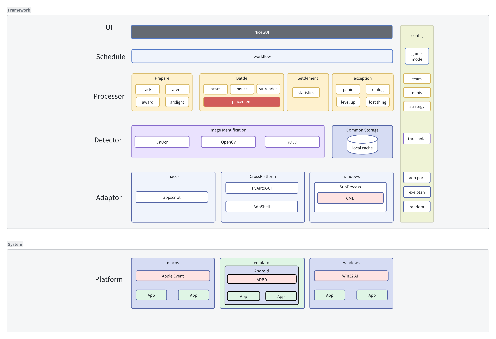
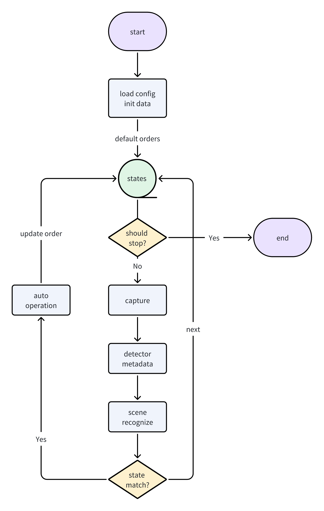

# Python学习实践-简单游戏自动化脚本的实现
以Warcraft Rumble游戏为例

## 基本框架

### Adaptor
适配层主要与系统App通信及自动化操控。
* 模拟器上的Android App: 使用ADB进行交互，推荐第三方客户端AdbShell，接口封装度高。如果用官方下载的adb工具，Python中需要通过子进程调用，比较麻烦。ADB协议本身就是跨平台的。
* windows App: 比如想要打开或者关闭模拟器，使用Python子进程运行windows cmd来实现。
* mac app: mac m芯片可原生运行大部分ios app，使用appscript来开启、全屏化及关闭App，使用pyautogui模拟鼠标和键盘自动化控制App。

### Detector
识别层主要检测App当前的状态信息，供上层使用。
* cnocr: 检测画面中的文本信息。
* opencv: 提供图像匹配、图像比较等能力，检测画面是否存在目标图像。
* yolo模型: 目标检测模型，通过数据集进行训练，可提供更精确的目标识别能力。
* 其他诸如APP是否在运行等基础信息。

### Processor
处理层主要根据识别层提供的数据，判断游戏当前的场景(或状态,下文场景状态混用，意思一样)并进行决策执行。
* 游戏中的每个场景(状态)都有一个对应的processor。
* processor会检测当前App是否处于其负责的场景。
* processor运行自己的决策逻辑，最终输出操作指令给适配层执行。

### Schedule
调度层根据游戏流程来编排Processor执行顺序，并处理各种意外情况，保证程序稳定运行。

### UI
ui提供图形化的用户操作界面，可以修改配置并启动或关闭程序。

### Config
程序运行时依赖的配置项，可通过UI让用户修改。

## 调度过程
如果游戏流程比较复杂且不稳定，线性调度编程会复杂并难以维护。采用类似状态机的状态流转式调度实现会更加清晰并具有较高的稳定性保证。

## 主要使用的仓库

* [adb-shell](https://github.com/JeffLIrion/adb_shell) ADB的Python实现，和Android模拟器进行交互。
* [PyAutoGUI](https://github.com/asweigart/pyautogui) 纯Python跨平台的GUI自动化工具，可用程序自动控制鼠标和键盘操作。
* [appscript](https://github.com/hhas/appscript/blob/master/py-appscript/README.rst)  高层级用户友好的AppleEvent桥接器，使用Python控制 [AppleScriptable](https://developer.apple.com/documentation/scriptingbridge) Mac应用程序。
* [cnocr](https://github.com/breezedeus/CnOCR) 使用非常便捷的开源ocr框架。
* [opencv-python](https://github.com/opencv/opencv-python) 强大的计算机图像处理引擎的Python SDK。
* [YOLOv8](https://github.com/ultralytics/ultralytics) 上手比较容易地识别模型训练引擎，速度和准确性都非常好。
* [nicegui](https://github.com/zauberzeug/nicegui/) Python的GUI框架，没发现比这个使用更简单的了，基于web技术。
* [pyinstaller](https://github.com/pyinstaller/pyinstaller) 将Python脚本构建成应用程序，支持多平台。
* [pyyaml](https://github.com/yaml/pyyaml) Python读写yaml配置文件。

